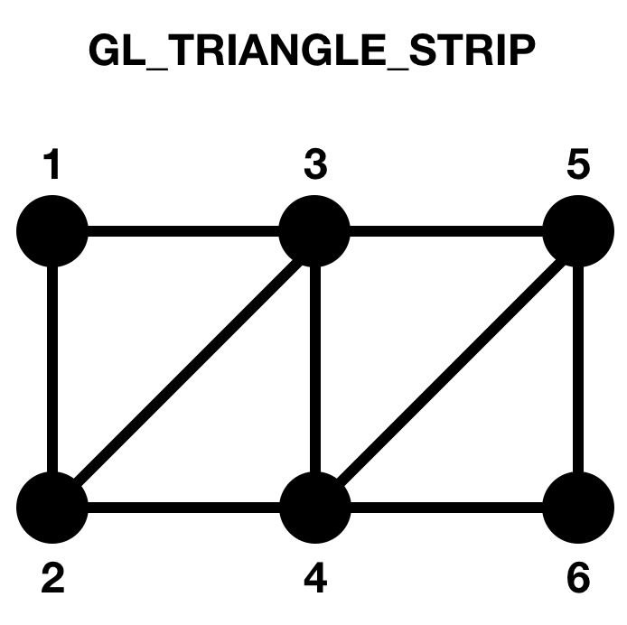
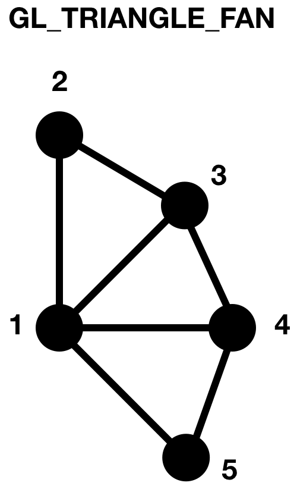

# Graphics-Starter

Ready for your first C++ graphics program?!

The main branch is protected. Create a branch with your netid.

### Setup on Mac:
* When you run the project, a black square graphics window should appear. You can press the escape key to exit.

### Setup on Linux:
* Your CMakeLists.txt file has to be configured differently. Use CMakeLists-Linux.txt.
* When you run the project, a black square graphics window should appear. You can press the escape key to exit.

### Setup on PC (sorry Windows people):
* Unzip/extract the freeglut zip file.
* Add a freeglut folder in this directory: C:/Program Files/Common Files/freeglut/
* Copy the include/ and lib/ folders from freeglut into that freeglut/ folder.
* Add freeglut.dll from freeglut/bin/ to the cmake-build-debug/ folder.
    * Note: You will need to do this for every CLion graphics project you create.
* When you run the project, a black square graphics window should appear. You can press the escape key to exit.
* Troubleshooting:
    * Q: Why does it say it cannot configure my lib files?
      
      A: Modify the following line in CMakeLists.txt:
      
      ```set(FREEGLUT_LIBRARY_DIRS "C:/Program\ Files/Common\ Files/freeglut/lib")```
      
      to direct it into the x64 folder:
      
      ```set(FREEGLUT_LIBRARY_DIRS "C:/Program\ Files/Common\ Files/freeglut/lib/x64")```

    * Q: Why am I getting a long, strange non-zero exit code?

      A: You may need to change the freeglut.dll file in the bin folder to the x64 version. In your freeglut download, the bin folder should have an x64 folder with freeglut.dll inside. Put that one in your CLion project cmake-build-debug folder.

## Graphics Window

Congratulations, you have run your first graphics program! It is appropriately a black box, since the code should be unknown to you.

C++ is the most commonly used language for writing game engines. 
* It is used for traditional PlayStation game development.

We are creating graphics using OpenGL and GLUT.
* OpenGL draws the graphics.
* GLUT creates the window and event listeners.
    * Event-driven programming is when functions are designed to capture interruptions like keyboard input, mouse clicks, and timer ticks.
    * In our program, the `display` function is called over and over again (similar to an infinite while loop). Other functions like `kbd`, `mouse`, and `cursor` are triggered when those events occur.
    
Read through graphics.h and graphics.cpp and answer the following questions in your branch's README file.
* Change the dimensions in the init function. 
    * What changed when you ran the program?
        it widened/shrunk the window when height/width was changed
* Change the color in the initGL function. 
Note: If your graphics program continues to show up as a black box, hide/minimize the executable and show/open it again. If that doesn't fix it, the colors will likely show up once you start drawing in the next section.
    * What changed? 
        The color of the window changed
    * What values make it gray?
        when they are all the same, ex 1/2 for all values works
    * What values make it yellow?
        a combination of red and green, ex 1 red and 1 green
* Scroll down to `main` and change the window position. 
    * Where is (0, 0)?
       the top left corner
* Change the title.
    * Where is it on the screen?
        At the top of the window
    
## Drawing

In the display function, where the comments say to draw, add the following lines:
```
// Set the color to draw
// Note: you can change this at any time during the drawing process
glColor3f(1.0, 0.0, 0.0);
glBegin(GL_QUADS);
// glVertex2i takes a 2-D (x, y) coordinate
glVertex2i(10, 50);
glVertex2i(10, 90);
glVertex2i(50, 90);
glVertex2i(50, 50);
glEnd();
```
Note to Mac users running Catalina: If the red quad shows up in the bottom half of your screen, change the glViewport line at the top of the display function by multiplying the width and height arguments by 2.

* Change the color of the quad by modifying the call to `glColor3f`.
    * What is the range of values for each part of the color?
        The range of colors is from 0-1.
* Move the quad down and to the right by 50 pixels.
    * Is the positive x direction left or right?
        right
    * Is the positive y direction up or down?
        down
* Make each vertex a different color by adding calls to `glColor3f` before each call to `glVertex2i`.
    * Describe the quad's appearance.
       it looks like a gradient that spreads from each vertex to the center
* Swap the third and fourth coordinates of the quad.
    * What does it look like?
      it looks like a paper crown..like two triangles in opposite directions

Besides GL_QUADS, there are many other shape options:
* Draw a new shape using GL_TRIANGLES (3 coordinates instead of 4).
    * Put six coordinates instead of 3. What happens? Another triangle appears. Two triangles!
* Draw a new shape using GL_TRIANGLE_STRIP.
    * If you add a vertex n to a triangle strip (where n >= 3), which two vertices does it connect to?
       It connected the last two in the list, ex the two corners facing outwards on my triangle




* Draw a new shape using GL_TRIANGLE_FAN.
    * How does this one look different?
       it looks like a fan of triangles
If you were to draw a circle, which of the modes above would you use and why?
   i would use triangle fan and make a bunch of fan parts and then it would look like a circle
Draw in a function other than display. What happens? (Hint: What *doesn't* happen?)
   it doesn't make the shape!
## Extra Time?

Make your code more dynamic: use global variables for the coordinates and color of a shape.
* In the cursor function, move the shape's center to the x and y parameters.
* In the mouse function, change the color of the shape.
    * What is the difference between the cursor and mouse functions?
* In the keyboard function, make the shape bigger when you press 'b' and smaller when you press 's'.
* In the timer function, move the shape down every 50 milliseconds.
